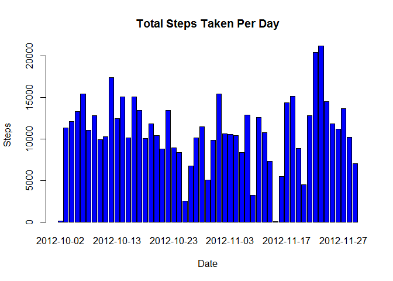
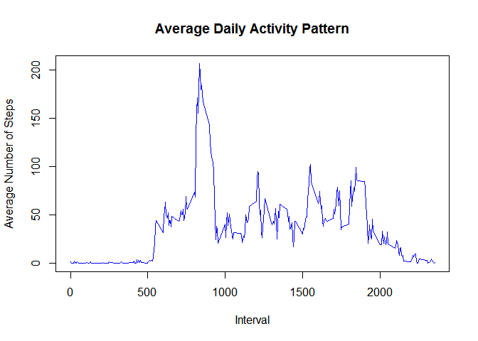
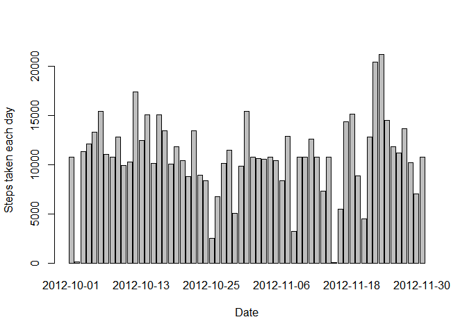
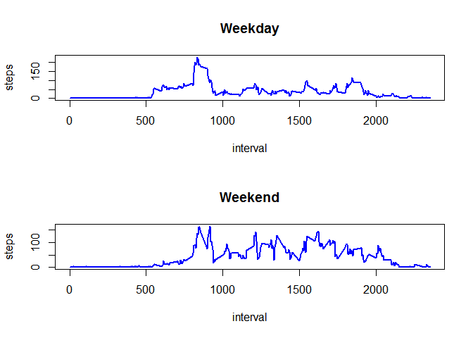

# Reproducible Research: Peer Assessment 1
Anizah Nordin  
13 October 2015  


## Loading and preprocessing the data

Load the data (i.e. read.csv())


```r
dActivity <- read.csv("activity.csv")
```

Check if data need to be transform into a suitable format for analysis


```r
str(dActivity)
```

```
## 'data.frame':	17568 obs. of  3 variables:
##  $ steps   : int  NA NA NA NA NA NA NA NA NA NA ...
##  $ date    : Factor w/ 61 levels "2012-10-01","2012-10-02",..: 1 1 1 1 1 1 1 1 1 1 ...
##  $ interval: int  0 5 10 15 20 25 30 35 40 45 ...
```

## What is mean total number of steps taken per day?

Make a histogram of the total number of steps taken each day (ignore missing values)


```r
totalSteps <- aggregate(steps ~ date, dActivity, sum)
barplot(totalSteps$steps, names.arg = totalSteps$date, xlab = "Date", ylab = "Steps", col="blue", main="Total Steps Taken Per Day")
```

 

Calculate and report the mean and median total number of steps taken per day (remove missing values)


```r
mean(totalSteps$steps, na.rm = TRUE)
```

```
## [1] 10766.19
```

```r
median(totalSteps$steps, na.rm = TRUE)
```

```
## [1] 10765
```

## What is the average daily activity pattern?

Make a time series plot (i.e. type = "l") of the 5-minute interval (x-axis) and the average number of steps taken, averaged across all days (y-axis)


```r
stepsInterval <- aggregate(steps ~ interval, dActivity, mean)
plot(stepsInterval, type = "l", main="Average Daily Activity Pattern", xlab="Interval", ylab="Average Number of Steps", col="blue")
```

 

Which 5-minute interval, on average across all the days in the dataset,   
contains the maximum number of steps?


```r
stepsInterval$interval[which.max(stepsInterval$steps)]
```

```
## [1] 835
```

## Imputing missing values

Calculate and report the total number of missing values in the dataset (i.e. the total number of rows with NAs)  


```r
sum(is.na(dActivity))
```

```
## [1] 2304
```

Create a new dataset that is equal to the original dataset but with the missing data filled in.


```r
dActivity <- merge(dActivity, stepsInterval, by = "interval", suffixes = c("", 
    ".y"))
nas <- is.na(dActivity$steps)
dActivity$steps[nas] <- dActivity$steps.y[nas]
dActivity <- dActivity[, c(1:3)]
```

Make a histogram of the total number of steps taken each day.   


```r
stepsDay <- aggregate(steps ~ date, dActivity, sum)
barplot(stepsDay$steps, names.arg = stepsDay$date, xlab = "Date", ylab = "Steps taken each day")
```

 

Calculate and report the mean and median total number of steps taken per day.


```r
mean(stepsDay$steps)
```

```
## [1] 10766.19
```

```r
median(stepsDay$steps)
```

```
## [1] 10766.19
```

## Are there differences in activity patterns between weekdays and weekends?

Create a new factor variable in the dataset with two levels -- "weekday" and "weekend" indicating whether a given date is a weekday or weekend day.


```r
dayType <- function(date) {
    if (weekdays(as.Date(date)) %in% c("Saturday", "Sunday")) {
        "Weekend"
    } else {
        "Weekday"
    }
}
dActivity$dayType <- as.factor(sapply(dActivity$date, dayType))
```

Make a panel plot containing a time series plot (i.e. type = "l") of the 5-minute interval (x-axis) and the average number of steps taken, averaged across all weekday days or weekend days (y-axis).


```r
par(mfrow = c(2, 1))
for (type in c("Weekday", "Weekend")) {
    stepsType <- aggregate(steps ~ interval, data = dActivity, subset = dActivity$dayType == type, mean)
    plot(stepsType, type = "l", main = type, col="blue", lwd = 2) 
    
}
```

 

